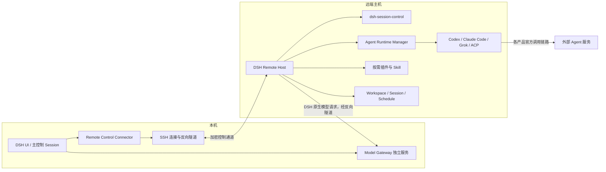

# DSH 远程项目、模型网关与 Agent 运行时架构

状态：已确认总体方向，待实现

日期：2026-08-21

适用基线：DeepSeek Harness `0.1.0-rc.6`

## 1. 决策摘要

DSH 远程项目采用“本机控制面 + 远端执行面”的结构：

- 本机 DSH 负责主界面、SSH 主机与项目管理、跨主机调度、模型与凭据配置，以及统一状态展示。
- 每台远端主机运行完整的 DSH Remote Host，拥有该主机上的 Workspace、Session、文件、Shell、沙箱、审批、定时任务和持久状态。
- DSH 原生 Agent 的模型调用默认经 SSH 反向隧道回到本机独立 Model Gateway，由本机现有模型、Provider 配置和凭据完成调用。
- 插件不全量镜像。远端项目只安装其配置明确需要、版本兼容且通过完整性校验的插件与 Skill。
- Codex、Claude Code、Grok Build 和 ACP 程序属于外部 Agent 运行时，不属于模型网关，也不作为每台远端主机的基础依赖；仅在项目启用对应渠道时按需安装。
- 外部 Agent 运行在项目文件所在的远端主机，默认使用各自的官方认证和模型调用链路。不得复制本机登录目录或令牌到远端。
- 权限以远端目标 Session 的 DSH 原生权限为最终事实。Full Access 控制器可以自主审批其受管任务；Workspace Write 控制器需要人工审批时，审批留在对应子会话，不集中到主会话。
- `dsh-session-control` 继续负责单个 DSH Host 内的会话、工作区、审批与定时语义；跨主机传输、远端部署和运行时管理放入新的公开仓库，不在本插件中堆叠 SSH 与安装逻辑。

## 2. 目标

用户只需在 DSH 中填写或选择 SSH 主机和远端绝对目录，即可完成：

1. 校验 SSH 主机身份并连接。
2. 检查远端 DSH Host，缺失时自动安装，版本不匹配时安全升级。
3. 创建或复用远端目录和 DSH Workspace。
4. 同步该项目需要的插件、Skill 和配置，不同步无关组件与凭据。
5. 检查并按需安装 Codex、Claude Code、Grok Build 或 ACP 运行时。
6. 对确实需要的外部运行时引导一次性认证。
7. 创建远端 Session，并在本机 DSH 中像本地项目一样发消息、查看状态、审批、定时和恢复。
8. 本机断线、DSH 重启或 SSH 重连后，以远端持久事实恢复展示，不重复执行无法确认的操作。

系统应支持长期自主运行，但必须诚实区分“远端仍在执行”“等待本机模型网关”“等待用户认证/审批”和“状态未知”。

## 3. 非目标

首版不做以下事项：

- 不把本地目录通过网络文件系统伪装成远端项目。
- 不把远端 Session 的 JSONL、SQLite 或进程内 Jobs 复制到本机后继续写入。
- 不公开暴露 DSH Remote Host 或 Model Gateway 端口。
- 不自动复制 `~/.codex`、`~/.claude`、`~/.grok`、浏览器 Cookie、OAuth Token 或 API Key。
- 不在所有远端主机上预装全部外部 Agent。
- 不把 Codex、Claude Code、Grok Build 的模型调用强行伪装成 DSH 原生模型调用。
- 不静默降级渠道、模型、权限或沙箱。
- 不在首版支持任意操作系统组合。首个正式目标为通过 OpenSSH 连接的 Linux x86_64 用户环境；其他平台在对应运行时通过实机验证后再开放。

## 4. 组件与仓库边界



### 4.1 `dsh-remote-control`（新公开仓库）

建议新建公开仓库 `dsh-remote-control`，包含：

- 本机 Remote Control Connector。
- SSH 主机、远端项目和连接状态 UI。
- 远端 Host Agent 的安装包与守护进程。
- Bootstrap、升级、回滚、健康检查和协议实现。
- 插件 Desired State 同步器。
- Agent Runtime Manager 与受信安装驱动。
- 远端 operation、重连和状态对账。

它可以由本机 DSH 插件启动和展示，但远端 Host Agent 是独立进程，不能依赖某个前台 Session 一直存活。

### 4.2 `dsh-model-gateway`（独立服务）

Model Gateway 单独版本化和运行，由本机 DSH 管理生命周期但不作为 Agent preset 内插件。职责是：

- 读取本机 DSH 已配置的 Provider、模型目录和凭据。
- 向已认证的远端 Host 提供受限模型调用接口。
- 统一流式响应、用量、错误和审计元数据。
- 隔离不同远端 Host，不把底层 Provider 密钥下发到远端。

它不负责远端文件、Shell、Session、插件、外部 Agent CLI 或第三方产品登录。

### 4.3 `dsh-session-control`（本仓库）

本插件继续保持单 Host 语义：

- Workspace、Session、权限、审批、Schedule 和 operation 的权威实现仍在目标 DSH Host 内运行。
- 远端 Connector 通过 Remote Host 的正式服务接口调用这些能力。
- 本插件不直接保存 SSH 密钥，不安装远端程序，也不建立跨主机共享 Session Registry。
- 同一套授权规则适用于本地 Host 和远端 Host，避免远端另造一套权限语义。

### 4.4 `dsh-subagent-code-agents`

多 Agent 插件继续负责渠道适配和统一工具，不负责自行下载程序。它需要新增：

- 每个渠道的运行时需求声明。
- 运行时探测结果和结构化不可用原因。
- 从目标 Session 继承的执行权限策略。
- Provider 级审批、沙箱和模型覆盖能力声明。
- 对不支持当前权限策略的渠道 fail closed。

## 5. 执行位置与模型路由

| 执行类型 | Agent 进程位置 | 是否需要远端外部 CLI | 默认模型调用位置 | 凭据位置 |
| --- | --- | ---: | --- | --- |
| DSH 原生 Agent / spawn / fork | 远端 DSH Host | 否 | 本机 Model Gateway | 本机 |
| Codex 渠道 | 远端项目主机 | 是 | Codex 官方链路 | 远端用户 |
| Claude Code 渠道 | 远端项目主机 | 是 | Claude Code 官方链路 | 远端用户或企业认证 |
| Grok Build 渠道 | 远端项目主机 | 是 | Grok 官方链路 | 远端用户或 API 认证 |
| ACP 渠道 | 远端项目主机 | 取决于 Agent | 由 ACP Agent 决定 | 由 ACP Agent 决定 |

外部 Agent 必须运行在项目文件和 Shell 所在主机。把外部 Agent 留在本机再通过 SSH 间接编辑，会改变其文件发现、Git、进程、沙箱和会话语义，不作为通用远程模式。

若企业要求所有网络出口经过本机，可以另加 SSH 代理隧道，但这只改变网络路径，不共享账号身份，也不把外部 Agent 变成 DSH 原生模型。

## 6. 用户流程

### 6.1 添加 SSH 主机

非技术用户界面只展示必要字段：

- 显示名称。
- SSH 配置中的主机别名，或主机名、端口和用户名。
- 认证方式状态；优先复用系统 SSH Agent、SSH Config 和已确认的 Host Key。

点击“连接”后自动执行：

1. Host Key 校验；未知或变化时必须明确提示，不能自动接受。
2. 远端平台、架构、Shell、磁盘、目录权限和网络预检。
3. 检查 Remote Host Agent 版本。
4. 上传经过哈希校验的安装产物到临时目录。
5. 以当前远端用户安装或原子升级；默认不要求 root。
6. 启动远端守护进程，通过 SSH stdio bridge 建立控制通道。
7. 建立只绑定远端 loopback 的 Model Gateway 反向隧道。

禁止使用未经固定版本和校验的远端 `curl | sh`。

### 6.2 添加远端项目

用户输入远端绝对目录并选择项目模式后，系统自动：

1. 规范化并校验路径位于允许范围。
2. 按授权创建缺失目录。
3. 创建或复用远端 DSH Workspace。
4. 计算项目 Desired State：DSH 版本、插件、Skill、Agent 渠道和权限。
5. 同步并验证插件。
6. 检查所需外部运行时；缺失时安装，未认证时进入认证步骤。
7. 创建 Session、应用权限预设并 attach Workspace。
8. 返回本机可打开的远端项目和 Session 标识。

目录、Workspace 和 Session 的部分成功必须原样报告；不能为了“看起来失败干净”而删除已经存在的用户目录或 Git 数据。

### 6.3 一次性外部运行时认证

安装可以自动化，第三方账号授权不能伪造为自动完成：

- Codex：在远端安装并认证可执行文件；本机 UI 转发官方登录提示或设备/浏览器授权流程。
- Claude Code：安装后使用官方账户、API 或企业平台认证。
- Grok Build：优先使用适合 SSH 环境的设备码登录；显式选择时可使用 API Key。
- ACP：由对应 Agent 的受信驱动声明认证方式。

DSH 只保存认证状态和脱敏错误，不读取、回传或同步第三方认证文件。认证过期时状态变为 `auth-required`，不得无限重试或静默切换渠道。

## 7. Remote Host 协议与事实归属

### 7.1 连接形态

- Bootstrap 与修复操作通过普通 SSH/SFTP 完成。
- 日常控制通过 SSH 启动的 stdio bridge 与远端守护进程通信。
- 守护进程只监听 Unix Domain Socket 或远端 loopback，不开放公网端口。
- 每次连接协商协议版本、Host ID、DSH 版本、插件能力、运行时能力和单调状态 revision。
- 正式 `dsh-session-control` Unix bridge 暴露 `remote-project.ping`、`remote-project.open`、`remote-project.schedule-create`、`remote-project.schedule-delete`、`remote-project.runtime-auth-begin`、`remote-project.runtime-auth-confirm` 和 `remote-project.execution-policy-verify`；来源 `sourceHostId/sourceSessionId` 只能命中 Host 配置的 capability allowlist，并映射到远端实际执行官方 API 的 `controllerSessionId`，不能拿跨 Host 来源 ID 查询远端 Agent。Schedule 创建/删除分别调用官方 `createSchedule` / `deleteSchedule` 并以独立幂等 operation 持久化，不允许通过重开项目或直接改 Session 日志冒充。
- runtime-auth 的 begin/confirm 只绑定来源控制端、目标 Host 和 exact runtime 的 server nonce，可在新项目 Session 创建前完成；`project.open` 成功后才用真实返回的 target Session 做执行策略快照和权限核验。这样不会要求预造同 ID target，也不会把来源身份误当 target Session。
- execution-policy verifier 每次 channel launch 都实时读取目标 Session 当前 permission/workspaceRoot/状态，并返回短时效的 `authority=dsh-session-control` 结果；不保留未消费的 capability map，不接受插件或模型请求自报 verified/provenance。
- Remote Host 的 Runtime Manager 是独立 `0600` Unix service，使用 Host-scoped owner-only capability token 文件认证；消息中的 `targetHostId/targetSessionId` 与 Connector 来源身份分层，resolve 仅接受已完成 project receipt 绑定的真实 target Session，并从 daemon 内 InstalledRuntimeManager 消费首次认证 lease。

### 7.2 单写者原则

- Workspace、Session 事件、Schedule、审批和远端 operation 只由远端 DSH Host 写入。
- 本机保存主机/项目配置、只读缓存和最后已确认 revision，不修改远端 JSONL 或 SQLite。
- 同一 Session 在任一时刻只能有一个权威 Session Actor。
- 断线重连只接受同一 Host incarnation 中更高 revision；Host 重装或状态重建时使用新的 incarnation ID。

### 7.3 幂等 operation

所有有副作用的远端调用都携带：

- `operationId`
- `idempotencyKey`
- `sourceHostId` / `sourceSessionId`
- `targetHostId` / `targetSessionId`（适用时）
- 请求正文哈希
- 权限快照与过期时间

网络中断后先查询 operation，再决定继续；无法证明终态时进入 `needs-attention`，不自动重复创建项目、Session、Schedule、插件安装或权限批准。

## 8. Model Gateway

### 8.1 默认路径

远端 DSH 原生 Agent 只获得一个短期 Gateway Endpoint 与 Host 作用域令牌：

```text
Remote DSH -> 127.0.0.1:<reverse-tunnel-port>
           -> SSH reverse tunnel
           -> local Model Gateway
           -> local provider/model/credential
```

Gateway 对远端暴露规范化的模型目录和调用能力，不暴露底层密钥。模型覆盖必须先在本机模型目录精确验证；未知模型直接拒绝。

### 8.2 本机离线

- 远端 DSH Host、Session、Schedule 和正在运行的远端进程继续存在。
- 已启动的外部 Agent 可以按其自身认证继续运行，结果写回远端持久状态。
- 新的 DSH 原生模型轮次进入 `waiting-for-gateway`，在隧道恢复后按幂等记录继续。
- 需要完全脱离本机运行的项目可以显式配置远端原生 Provider 凭据；它不是默认值，也不能由本机密钥自动复制产生。

长期自主运行因此有两种明确等级：

- `local-gateway-required`：默认，要求本机 DSH 与 Model Gateway 在线。
- `remote-autonomous`：远端明确配置模型或外部 Agent 认证，可以在本机离线期间继续其支持的工作。

## 9. 插件与 Skill 同步

远端 Desired State 由项目 preset 和管理员策略共同生成：

```ts
interface RemoteProjectDesiredState {
  dshVersion: string
  plugins: PluginRequirement[]
  skills: SkillRequirement[]
  runtimes: RuntimeRequirement[]
  defaultPermission: 'read-only' | 'workspace-write' | 'danger-full-access'
  modelRoute: 'local-gateway-required' | 'remote-autonomous'
}
```

同步规则：

- 只同步 allowlist 中且项目确实启用的插件与 Skill。
- 使用 Release、registry 或本机已锁定产物；传输前后校验版本、SHA-256 和清单。
- 插件声明 `control`、`remote` 或 `both` placement；只有远端部分安装到 Remote Host。
- 不复制插件运行状态、Session 数据、日志、缓存和凭据。
- 插件更新采用临时目录安装、探测、原子切换和可回滚旧版本。
- 插件与 DSH API 不兼容时保持旧版本或标记 `incompatible`，不能让整个 Host 半升级。
- 插件自带 Skill 随插件版本部署；项目 Skill 以项目 Desired State 独立同步。

`dsh-session-control` 在每个需要会话编排的远端 Host 上安装；多 Agent 插件只在项目启用外部渠道时安装。原有单 Codex 插件不作为远端基线，也不与多渠道插件重复安装。

## 10. Agent Runtime Manager

### 10.1 职责

Agent Runtime Manager 位于远端 Host Agent 内，负责：

- 平台与架构兼容性判断。
- 缺失、版本漂移和认证状态探测。
- 从受信来源安装固定版本并校验完整性。
- 为插件提供绝对可执行路径，不依赖交互式 Shell PATH。
- 管理升级、回滚、修复和卸载。
- 输出统一健康状态，不调用真实付费模型作为普通健康检查。

多 Agent 插件只声明需求，例如：

```ts
interface RuntimeRequirement {
  id: 'codex' | 'claude-code' | 'grok-build' | `acp/${string}`
  version: string
  installPolicy: 'on-demand'
  authPolicy: 'remote-user' | 'api-key' | 'driver-defined'
  updatePolicy: 'managed'
  requiredBy: string[]
}
```

安装驱动只能来自 Remote Host 的受信 registry；普通项目插件不能提交任意安装脚本并让 Host 执行。

### 10.2 安装布局

受管理的运行时放在远端用户目录，例如：

```text
~/.dsh-remote/
  host/
  plugins/
  runtimes/
    codex/<version>/
    claude-code/<version>/
    grok-build/<version>/
  state/
  logs/
```

渠道配置使用该目录下的绝对路径。若产品只能使用官方用户级安装路径，驱动必须记录真实路径与版本并探测漂移。

### 10.3 更新策略

- 默认由 DSH 管理版本，不允许三方自动更新在运行中改变协议行为。
- 官方运行时无法关闭自更新时，必须在每次启动前检测版本并在漂移后重新验收。
- 正在执行任务时不升级运行时。
- 升级失败保留旧版本；只有新版本探测通过才切换。
- 不自动跨越声明的不兼容主版本。

### 10.4 状态模型

每个运行时返回以下之一：

- `not-required`
- `missing`
- `installing`
- `auth-required`
- `ready`
- `update-required`
- `incompatible`
- `degraded`

如果产品没有可靠、无计费的认证探测接口，状态必须表达为“安装完成，认证待首次调用确认”，不能虚构 `ready`。

## 11. 权限、审批与沙箱

### 11.1 权威权限

远端目标 Session 的 DSH 原生权限预设是最终事实：

| 目标权限 | 外部 Agent 行为 | 审批位置 |
| --- | --- | --- |
| Read Only | 禁止写文件和有副作用命令 | 目标子会话 |
| Workspace Write | 只允许工作区内写入；需要提升时暂停 | 目标子会话 |
| Full Access | 可以按控制器授权自动执行 | Full Access 控制器可自主决定 |

DSH 的远端 OS 用户、文件围栏和进程沙箱是外层安全边界；外部产品自己的沙箱和审批是附加边界，不能反过来削弱 DSH 权限。

### 11.2 多 Agent 插件必须修改的现状

当前 `dsh-subagent-code-agents` 对 Codex、Claude Code、Grok Build 固定使用绕过审批和关闭产品沙箱的参数。这只适用于明确的 Full Access 任务，不能直接用于远端 Workspace Write 或 Read Only。

渠道适配器必须新增执行策略契约：

```ts
interface ChannelExecutionPolicy {
  permission: 'read-only' | 'workspace-write' | 'danger-full-access'
  approvalOwner: 'target-session' | 'full-access-controller'
  workspaceRoot: string
}
```

规则如下：

- Full Access 才允许传递 bypass/always-approve/sandbox-off 类参数。
- Workspace Write 和 Read Only 必须使用渠道支持的审批回调或受限模式，并由 DSH 外层沙箱兜底。
- 渠道无法兑现当前权限时，在启动前返回 `unsupported-permission-policy`，不得偷偷用 Full Access。
- Workspace Write 控制器不截获人工审批，审批卡保留在目标子会话。
- Full Access 控制器只能自主审批与其 operation、目标 Session、turn 和工具指纹匹配的请求。
- 权限或控制器身份变化后，尚未决审批立即失效并重新核对。

在该契约完成前，远端 Workspace Write 和 Read Only 项目不得启用三个固定 bypass 的外部渠道。

## 12. Schedule、断线与长期运行

- Schedule 继续写入远端目标 Session 的官方 `schedule/change` 事件流。
- 远端守护进程负责到期恢复 Session；本机 UI 不充当计时器。
- `local-gateway-required` 项目到期时若隧道不可用，记录一次 `waiting-for-gateway`，不按固定周期制造重复轮次。
- 隧道恢复后按 schedule occurrence ID 幂等投递。
- 已启动外部 Agent 的进程和结果由远端 Host 跟踪；本机重连后查询，而不是仅凭本地进度缓存猜测。
- Remote Host 重启后，对不能证明仍在运行的进程标记 `interrupted`；只有渠道提供可靠 resume 时才显示可续跑。
- 用户删除主机连接时默认只删除本机连接配置，不删除远端项目、Session、运行时或第三方登录状态。远端清理由单独、明确确认的操作完成。

## 13. 安全不变量

实现和评审必须始终满足：

1. 不自动接受未知或变化的 SSH Host Key。
2. 不开放 Remote Host 和 Model Gateway 公网监听端口。
3. 不把本机 Provider 密钥下发到远端。
4. 不复制第三方 Agent 的登录目录和令牌。
5. 不以 root 作为默认远端运行用户。
6. 不执行插件提供的任意安装脚本；安装驱动必须受信、固定版本并校验产物。
7. 不允许远端调用通过路径穿越、符号链接或配置覆盖突破项目允许范围。
8. 不允许 Workspace Write/Read Only 外部 Agent 以 Full Access 参数启动。
9. 不在网络错误后盲目重试有副作用操作。
10. 不把“进程已启动”“SSH 命令成功”或“有本地缓存”当作任务完成。
11. 日志和 operation 状态不得包含 prompt 全文、密钥、Cookie、认证文件或未经脱敏的环境变量。
12. 渠道、模型、权限、版本和认证失败都显式报告，禁止静默 fallback。

## 14. 故障与恢复语义

| 故障 | 行为 |
| --- | --- |
| SSH 临时断线 | 远端继续运行；本机重连后按 revision 对账 |
| 本机 Model Gateway 离线 | 原生模型轮次等待；不重复投递 |
| Remote Host Agent 缺失 | 自动 bootstrap；安装失败保留诊断和临时产物清理结果 |
| Remote Host 版本不兼容 | 停止创建新任务；提供安全升级或回滚 |
| 插件安装失败 | 保留已验证旧版本；目标项目标记 degraded |
| 外部运行时未安装 | 按需安装；其他渠道不受影响 |
| 外部运行时未认证/过期 | 标记 auth-required；不切换渠道 |
| 外部运行时自更新漂移 | 阻止新任务，重新探测兼容性 |
| 有副作用调用超时 | 查询 operation；无法确认时 needs-attention |
| 远端 Session cold | 通过远端 Core 恢复，完成后按原状态收敛 |
| 守护进程重启 | 恢复持久 operation；未知进程不伪装 active |

## 15. 实施路径

### 阶段 A：协议与最小远端闭环

- 创建公开 `dsh-remote-control` 仓库。
- 定义 Host/Project/Operation/Capability 协议与版本协商。
- 完成 Linux x86_64 SSH bootstrap、Remote Host 守护进程和 stdio bridge。
- 完成远端目录 → Workspace → Session 创建。
- 接入远端 `dsh-session-control` 的项目、会话、权限和 Schedule 语义。
- 完成本机 Model Gateway 和反向隧道，使 DSH 原生 Agent 可运行。

验收：全新 SSH 主机无需手工终端命令即可创建项目和 Session；断线重连后状态一致；不安装任何外部 Agent 也能使用 DSH 原生多 Agent。

### 阶段 B：插件 Desired State

- 定义插件/Skill placement、锁定版本、哈希、兼容性和原子升级协议。
- 自动部署远端所需的 `dsh-session-control` 与项目 Skill。
- 保证凭据、运行状态和无关本机插件不参与同步。

验收：不同远端项目可以拥有不同插件集合；失败不会破坏已验证版本。

### 阶段 C：外部 Agent 运行时

- 实现 Runtime Manager 和 Codex、Claude Code、Grok Build 驱动。
- 多 Agent 插件声明运行时需求，不再只依赖 PATH 猜测。
- 完成安装、版本、认证引导、状态展示和升级回滚。
- 完成渠道执行权限策略；先支持能够兑现权限语义的渠道。

验收：只安装项目需要的渠道；首次认证后可长期运行；认证过期、版本漂移和权限不兼容均 fail closed。

### 阶段 D：韧性与运维

- 补充远端 Host 更新环、日志导出、诊断包和显式卸载。
- 验证 Schedule、本机离线、Host 重启、Gateway 重启和长任务恢复。
- 在有实机和供应商运行时支持证据后扩展 Linux ARM64、macOS 或 Windows OpenSSH。

验收：故障注入后不重复副作用、不丢失权威终态、不暴露凭据。

## 16. 总体验收标准

功能完成必须同时满足：

- 在 DSH UI 中添加 SSH 主机和绝对目录即可创建远端项目，无需用户手工安装 DSH。
- DSH 原生 Agent 默认通过本机 Model Gateway 使用本机模型配置。
- 项目不启用外部渠道时，远端不会安装 Codex、Claude Code 或 Grok Build。
- 启用渠道后可自动安装固定版本，并明确引导一次性认证。
- 本机与远端凭据不会互相复制。
- 插件和 Skill 按项目 Desired State 同步，具备校验、原子切换和回滚。
- Workspace、Session、Schedule、审批和 operation 由远端单写者持久化。
- Full Access 与 Workspace Write 的审批位置和自主能力符合本仓库现有规则。
- 外部 Agent 无法满足权限策略时拒绝启动，不以 bypass 参数绕过。
- SSH、Gateway 或 Host 重启后能够对账；状态未知时明确 `needs-attention`。
- 本机 DSH 可以同时管理多个远端 Host 和多个项目，Host 之间状态、令牌和缓存隔离。
- 所有安装、升级、权限变化、认证状态变化和远端操作都有不含秘密的审计记录。

## 17. 已确定与延后决策

已经确定：

- 本机控制面、远端完整 DSH Host。
- Model Gateway 独立服务，默认复用本机模型和凭据。
- 插件选择性同步，不全量镜像。
- 外部 Agent 运行时按需远端安装，不作为基础依赖。
- 外部 Agent 凭据留在远端，不复制本机登录态。
- Full Access 可自主审批；Workspace Write 的人工审批留在子会话。
- `dsh-session-control` 保持单 Host，跨主机能力进入新仓库。

延后到实现前的定向验证：

- 各供应商运行时可固定版本、关闭自更新和无计费检查认证状态的具体命令。
- Codex、Claude Code、Grok Build 在 Read Only/Workspace Write 下可用的正式审批回调和沙箱能力。
- Model Gateway 的具体上游协议映射和流式事件格式。
- Remote Host 守护进程在无 systemd 环境中的保活实现。

这些验证可以改变驱动细节，但不得放宽第 13 节的安全不变量。

## 18. 参考资料

- [OpenAI Codex Remote Connections](https://learn.chatgpt.com/docs/remote-connections)
- [Claude Code：安装与认证](https://code.claude.com/docs/en/getting-started)
- [Grok Build Overview](https://docs.x.ai/build/overview)
- [Grok Build CLI Reference](https://docs.x.ai/build/cli/reference)
